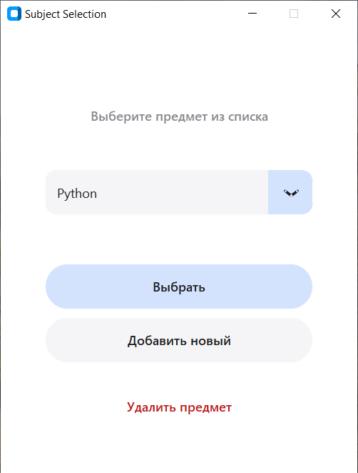
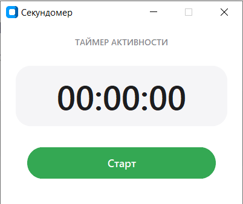
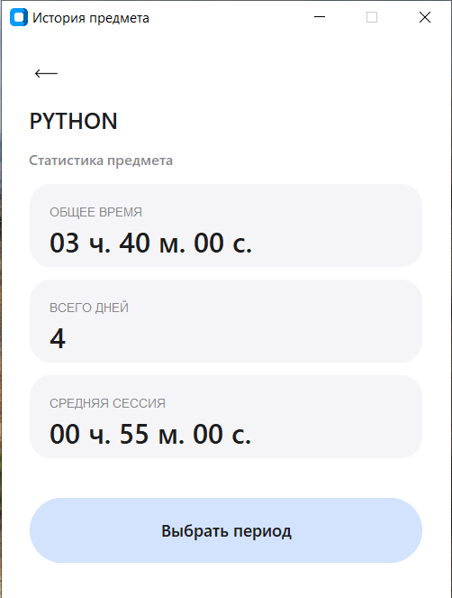

# Трекер учебного времени

Простое настольное приложение для отслеживания времени, затраченного на изучение различных предметов.

Программа позволяет запускать и останавливать учебные сессии, сохранять историю занятий и анализировать затраченное время.

Приложение написано на **Python** с использованием **CustomTkinter** для современного интерфейса.

---

## Интерфейс приложения

### Главное окно



### Секундомер



### История занятий



---

## Возможности

* запуск и остановка учебной сессии
* учёт времени по каждому предмету
* сохранение истории занятий
* просмотр истории по выбранному предмету
* фильтрация истории по диапазону дат
* простой и удобный графический интерфейс

---

## Используемые технологии

* Python 3.12
* customtkinter
* tkcalendar

---

## Установка

1. Клонируйте репозиторий:

```
git clone https://github.com/amne3u9/stopwatch.git
```

2. Перейдите в папку проекта:

```
cd stopwatch
```

3. Установите зависимости:

```
pip install -r requirements.txt
```

---

## Запуск приложения

```
python app/main.py
```

---

## Структура проекта

```
stopwatch/
├── app/
│   ├── assets/
│   │   ├── icons/
│   │   │       icon_back.png
│   │   └── screenshots/
│   │       ├── history_window.png
│   │       ├── start_window.png
│   │       └── stopwatch_window.png 
│   │
│   ├── main.py
│   ├── db_manager.py
│   ├── demo_data.json
│   ├── gui_date_range_selection.py
│   ├── gui_history.py
│   ├── gui_stopwatch.py
│   ├── gui_subject_manager.py
│   ├── stopwatch.py
│   ├── subject_menu.py
│   └── utils.py
│
│
├── docs/
│
├── .gitignore
├── requirements.txt
└── README.md
```

---

## Тестирование

В настоящее время проводится функциональное тестирование приложения.

Проверяются:

* корректная работа секундомера
* сохранение учебных сессий
* корректность истории занятий
* фильтрация истории по датам
* навигация по интерфейсу

---

## Планы по развитию

* добавление статистики
* расширенная аналитика по предметам
* улучшение интерфейса

---

## Лицензия

Проект распространяется как открытое программное обеспечение.
